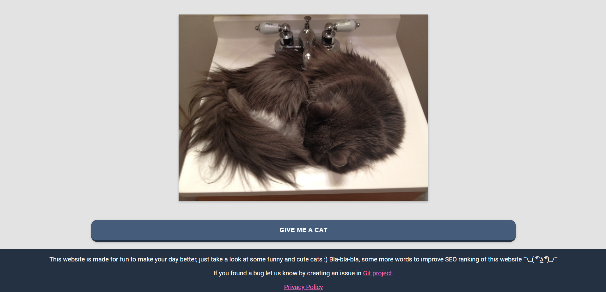

[](https://github.com/Yashmerino/random-cat-generator/actions/workflows/node.js.yml)

<h1 align="center"><strong><em>Random Cat Generator</strong></em></h1>

<p>To contribute to this project:</p> 

* You have to have Node.js installed. You can download it here: <a href="https://nodejs.org/en/">Link</a>
* After that clone the Git repository.
* Open "cmd" in repository root and run these commands:
```
npm install
npm start // For development
npm run build // For production
```

<h1 align="center"><strong>Demonstration</strong></h1>
<p align="center"></p>
